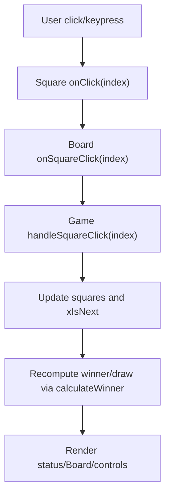

# Architecture

## Overview
The Tic Tac Toe frontend is a small React application with a clear separation between stateful game logic and presentational components. Styling is implemented with pure CSS variables and classes in App.css following the Ocean Professional theme.

## High-Level Structure
- Entry: src/index.js
- App shell: src/App.js
- Core state and logic: src/components/Game.js
- Presentational grid: src/components/Board.js
- Atomic cell: src/components/Square.js
- Styles: src/App.css

## Component Responsibilities
### App (src/App.js)
- Provides the page layout container (`.ocean-app`) and renders the Game.
- Imports the theme and component styles from App.css.

### Game (src/components/Game.js)
- Owns the board state (Array(9).fill(null)) and current player (xIsNext).
- Derives the winner and winning line via calculateWinner(sq).
- Derives draw state when all squares are filled with no winner.
- Renders:
  - Header (title and theme subtitle)
  - Status banner (role="status", aria-live="polite")
  - Board (disabled when game is over)
  - Controls (Reset/New Game button)
  - Helper hint for keyboard usage
- Exposes two key handlers:
  - handleSquareClick(index) for turn-taking
  - resetGame() to clear state

### Board (src/components/Board.js)
- Renders role="grid" 3x3 board using the squares prop.
- Computes which squares belong to the winning line.
- Delegates interaction back to Game via onSquareClick.
- Disables squares when filled or when the game is over.

### Square (src/components/Square.js)
- Renders an individual cell as a button (role="gridcell").
- Applies variant classes:
  - .x for X, .o for O, .win for winning squares
- Provides aria-labels like "Cell 1, X" or "Cell 1, empty".
- Supports keyboard and pointer interactions.

## State and Data Flow
- Game owns all state:
  - squares: string[9] with values "X" | "O" | null
  - xIsNext: boolean, true for X’s turn
- calculateWinner(sq) returns:
  - winner: "X" | "O" | null
  - line: number[] | null (e.g., [0,4,8])
- Game -> Board (props): squares, winningLine, disabled, onSquareClick
- Board -> Square (props): value, isWinning, disabled, index, onClick
- User actions bubble up (Square -> Board -> Game) to update state.

## Styling and Theming
- Theme variables in src/App.css under “Ocean Professional Theme”:
  - --primary: #3b82f6
  - --secondary: #64748b
  - --success: #06b6d4
  - --error: #EF4444
  - --background: #f9fafb
  - --surface: #ffffff
  - --text: #111827
- Components use semantic class names: .game-card, .status, .board, .square, .controls, .btn, etc.
- Accessibility and interaction affordances:
  - :focus-visible ring via --ring rgba(59,130,246,0.35)
  - Subtle shadows and radius tokens: --shadow, --radius-*

## Accessibility Model
- Board container uses role="grid" with aria-label and aria-disabled.
- Square buttons use role="gridcell" and are keyboard-focusable.
- Status region uses role="status" with aria-live="polite".
- Badge elements display the current or winning player visually.
- Contrast and focus states are tuned for clarity.

## Build and Runtime
- Dev server: react-scripts start (port 3000)
- Production: react-scripts build outputs static assets to build/
- Tests: react-scripts test with Jest + React Testing Library scaffold

## Error Handling and Edge Cases
- Clicking a filled square or after a win is ignored.
- Draw detection when all squares are non-null without a winner.
- Disabled board after game end to prevent further moves.

## Extension Points
- Extract calculateWinner into a separate utility module if adding AI or move history.
- Introduce context or a state manager if the game grows in complexity.
- Add persistence (localStorage) for session resume or scoreboard.

## File Reference
- src/App.js — application shell
- src/components/Game.js — game logic and state
- src/components/Board.js — grid rendering
- src/components/Square.js — individual cell
- src/App.css — theme and UI styles
- src/index.js — app entry point
